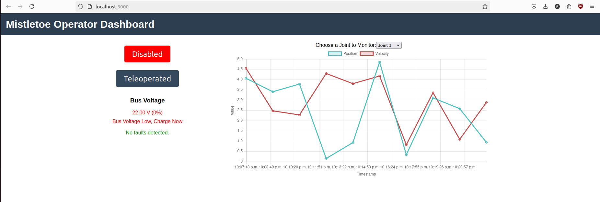

# Dashboard Module  
This module is intended to be run on a control computer than connects to the onboard system modules of the quad wirelessly.  

  

<!-- 

  <caption>Note: Sample image uses random values.</caption>

 -->

## Installation Steps  
Enter the `main-dashboard/frontend` directory and run `npm install`.

Ensure you have the dependecies of the backend by entering the `main-dashboard/backend` directory and running `pip install -r requirements.txt`. Make sure you have LCM installed.  
## Running the Main Dashboard  
### Running dashboard with robot
Enter the `main-dashboard/frontend` directory and run `npm start` to start the frontend server.  
In a seperate terminal, enter the `main-dashboard/backend` directory and run the `socket_server_lcm.py` file.
### Running dashboard without robot  
In the case in which you want to test out the dashboard without the robot enabled (ie. during development), you can run the `lcm_publisher_test.py` file which publishes random data to the required LCM channels.